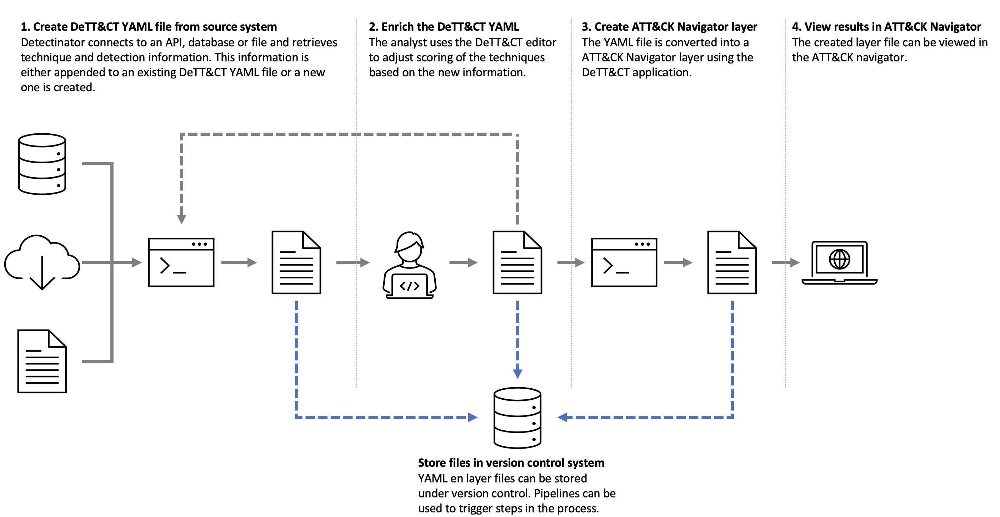

# Dettectinator
Dettectinator - The Python library to your DeTT&amp;CT YAML files.

[DeTT&CT](https://github.com/rabobank-cdc/DeTTECT) is a framework that helps blue teams in using MITRE ATT&CK to score and compare data log source quality, visibility coverage, detection coverage and threat actor behaviours. All administration is done in YAML files which can be editted via the [DeTT&CT Editor](https://rabobank-cdc.github.io/dettect-editor). But what if you want to automate the generation and modification of these YAML files? That's were Dettectinator comes in!

Dettectinator is built to be included in your SOC automation tooling. It can be included as a Python library (`pip install dettectinator`) or it can be used via the command line (`python dettectinator.py -h`).

Dettectinator also provides plugins to read detections from your SIEM or EDR and create a DeTT&CT YAML for it, so that you can use it to visualize your ATT&CK detection coverage in the ATT&CK  Navigator. Currently, we have plugins for the following tools:
- Microsoft Sentinel: Analytics Rules (API)
- Microsoft Defender: Alerts (API)
- Microsoft Defender: Custom Detection Rules (API, _under construction_)
- Microsoft Defender for Identity: Detection Rules (loaded from MS Github)
- Tanium: Signals (API)
- Elastic Security: Rules (API)
- CSV: any csv with detections and ATT&CK technique ID's (file)
- Excel: any Excel file with detections and ATT&CK technique ID's (file)
- Suricata rules (file)
- Sigma rules (folder with YAML files)

> Currently de CLI is limited to processing detections through these plugins, the library can also be used for processing data sources.

### Usage as Python library

Install the Python library with `pip install dettectinator` and include one of the classes underneath to your python code. With these classes you are able to programmatically edit DeTT&CT YAML files. It supports creating data source administration and techniques administration YAML files and it also support the mutation of existing files. Mutations are annotated in the comment fields (for detections in the score logbook).

- DettectDataSourcesAdministration
- DettectTechniquesAdministration

`from dettectinator import DettectDataSourcesAdministration`

You can instantiate the classes with a reference to your YAML file or leave it blank to create a new YAML file.

You can optionally specify the `local_stix_path` parameter that refers to a location of a local STIX repository containing the MITRE ATT&CK STIX objects. Dettectinator uses this repository to generate the YAML files. This repository can be cloned from here: https://github.com/mitre/cti. If you don't specify a `local_stix_path` parameter, an attempt will be made to download the information via MITRE's TAXII server.

**DettectDataSourcesAdministration**

```python
# Open an existing YAML file:
dettect_ds = DettectDataSourcesAdministration('data_sources.yaml')

# Or create a new YAML file:
dettect_ds = DettectDataSourcesAdministration()

# Determine your data sources somewhere/somehow in your code and put them in a dictionary.
# data_quality is optional. When omitted default scores of 1 will be used for all data quality dimensions.
# For example like this:
data_sources = {}
data_sources['Process Creation']    = [{'applicable_to': ['all'],
                                        'products': ['Windows Event Log'],
                                        'available_for_data_analytics': True,
                                        'data_quality': { 'device_completeness': 5,
                                                          'data_field_completeness': 5,
                                                          'timeliness': 5,
                                                          'consistency': 5,
                                                          'retention': 5}
                                       },
                                       {'applicable_to': ['laptops'],
                                       'products': ['Sysmon'],
                                       'available_for_data_analytics': True}]
data_sources['Command Execution']   = [{'applicable_to': ['servers'],
                                        'products': ['Sysmon'],
                                        'available_for_data_analytics': True}]
data_sources['Process Termination'] = [{'applicable_to': ['all'],
                                        'products': ['Sysmon'],
                                        'available_for_data_analytics': True}]
data_sources['Drive Creation']      = [{'applicable_to': ['workstations'],
                                        'products': ['Windows Event Log'],
                                        'available_for_data_analytics': True}]

# Update the YAML file with the given data sources:
# - check_unused_data_sources: Warn on data sources that are not present in the imported set of data sources.
# - clean_unused_data_sources Clean data sources that are not present in the imported set of data sources.
warnings, results = dettect_ds.update_data_sources(data_sources, check_unused_data_sources=True, clean_unused_data_sources=True)

# Optionally set a name to be used in the YAML file:
dettect_ds.set_name('My Organization')

# Save the YAML file. Leave filename empty to overwrite the loaded YAML file.
dettect_ds.save_yaml_file('data_sources_updated.yaml')
```

**DettectTechniquesAdministration**

```python
# Open an existing YAML file:
dettect = DettectTechniquesAdministration('techniques.yaml')

# Or create a new YAML file:
dettect = DettectTechniquesAdministration()

# Determine your detections somewhere/somehow in your code and put them in a dictionary. For example like this:
rules = {}
rules['Detection A'] = {'applicable_to': ['all'],                       'location_prefix': 'Splunk', 'techniques': ['T1055']}
rules['Detection B'] = {'applicable_to': ['all'],                       'location_prefix': 'Splunk', 'techniques': ['T1529']}
rules['Detection C'] = {'applicable_to': ['Windows 3.1'],               'location_prefix': 'Splunk', 'techniques': ['T1055']}
rules['Detection D'] = {'applicable_to': ['Windows 3.1', 'Windows 97'], 'location_prefix': 'EDR',    'techniques': ['T1055']}
rules['Detection E'] = {'applicable_to': ['Windows 3.1', 'Windows 97'], 'location_prefix': 'EDR',    'techniques': ['T1561']}
rules['Detection F'] = {'applicable_to': ['Windows 3.1', 'Windows 97'], 'location_prefix': 'EDR',    'techniques': ['T1561']}
rules['Detection G'] = {'applicable_to': ['all'],                       'location_prefix': 'EDR',    'techniques': ['T1561']}

# Update the YAML file with the given detections.
# - check_unused_detections: Warn on detections that are not present in the imported set of detections.
# - clean_unused_detections: Clean detections that are not present in the imported set of detections.
# - location_prefix_unused_detections: Only check unused detections with this location prefix.
# - check_unused_applicable_to: Warn on applicable_to values that are not present in the imported set of detections.
# - clean_unused_applicable_to: Clear applicable_to values that are not present in the imported set of detections.
warnings, results = dettect.update_detections(rules, check_unused_detections=True, clean_unused_detections=True, location_prefix_unused_detections='', check_unused_applicable_to=False, clean_unused_applicable_to=False)

# Optionally set a name to be used in the YAML file:
dettect_ds.set_name('My Organization')

# Save the YAML file. Leave filename empty to overwrite the loaded YAML file.
dettect.save_yaml_file('techniques_updated.yaml')
```

### Usage as command line tool

You can use the command line tool to generate DeTT&CT techniques administration YAML files based on detections including their ATT&CK mapping from your SIEM / EDR. We have multiple plugins available that get this information from an API, file or other source. We call that data import plugins.

These data import plugins adds detections in the location field of a detection object for a specific ATT&CK technique (taking the applicable_to value into account). A default detection score of "1" is used for new techniques. When a technique was already present in a given YAML file, the score will be preserved, and a score logbook entry will be added with a "TODO" to let you know to review the score.

To run the CLI tool you need to install the required libraries first:
```commandline
pip install -r requirements.txt
```

The command line tool requires a data import plugin parameter to be specified. To get a list of available plugins run dettectinator.py without any argument:

```commandline
python dettectinator.py
Please specify a valid data import plugin using the "-p" argument:
 - ImportCsv
 - ImportDefenderAlerts
 - ImportDefenderIdentityRules
 - ImportElasticSecurityRules
 - ImportExcel
 - ImportSentinelAlertRules
 - ImportSigmaRules
 - ImportSuricataRules
 - ImportTaniumSignals
```

Select a data import plugin and specify it using the `-p` argument. To see a list of all parameters add the `-h` argument, for example:

```
python dettectinator.py -p ImportTaniumSignals -h

usage: dettectinator.py [-h] [-c CONFIG] -p PLUGIN -a APPLICABLE_TO [-d {enterprise,ics,mobile}] [-i INPUT_FILE] [-o OUTPUT_FILE]
                        [-n NAME] [-ri RE_INCLUDE] [-re RE_EXCLUDE] [-s STIX_LOCATION] [-l LOCATION_PREFIX] [-ch] [-cl] --host HOST --user USER --password PASSWORD [--search_prefix SEARCH_PREFIX]

options:
  -h, --help            show this help message and exit
  -c CONFIG, --config CONFIG
                        Configuration file location.
  -d {enterprise,ics,mobile}, --domain {enterprise,ics,mobile}
                        The ATT&CK domain (default = enterprise). This argument is ignored if a domain is specified in the YAML file.
  -i INPUT_FILE, --input_file INPUT_FILE
                        YAML filename for input.
  -o OUTPUT_FILE, --output_file OUTPUT_FILE
                        YAML filename for output.
  -n NAME, --name NAME  Value for the name attribute in the YAML file.
  -ri RE_INCLUDE, --re_include RE_INCLUDE
                        Regex for detection names that should be included.
  -re RE_EXCLUDE, --re_exclude RE_EXCLUDE
                        Regex for detection names that should be excluded.
  -s STIX_LOCATION, --stix_location STIX_LOCATION
                        Local STIX repository location.
  -l LOCATION_PREFIX, --location_prefix LOCATION_PREFIX
                        Location of the detection, will be prepended to the detection name.
  -ch, --check_unused   Check unused detections.
  -cl, --clean_unused   Clean unused detections.

required arguments:
  -p PLUGIN, --plugin PLUGIN
                        Data import plugin name.
  -a APPLICABLE_TO, --applicable_to APPLICABLE_TO
                        Systems that the detections are applicable to (comma seperated list).

ImportTaniumSignals:
  --host HOST           Tanium host
  --user USER           Tanium API username
  --password PASSWORD   Tanium API password
  --search_prefix SEARCH_PREFIX
                        Search prefix

```

The command line tool has default arguments and arguments that are data import plugin specific. The default arguments are described below.

#### Configuration file location: `-c`, `--config`
You can optionally supply the location of a configuration file. All Dettectinator and data import plugin arguments can also be supplied in this configuration file. The config file is in JSON format, all arguments need to be defined in their 'long' format, for example:

```json
{
  "plugin":  "ImportCsv",
  "applicable_to": "Windows servers, Windows desktops",
  "check_unused": 1,
  "file": "../examples/import.csv"
}
```
Any argument supplied on the command line will overrule the value supplied in the config file.

#### Data import plugin name (required): `-p`, `--plugin`

Dettectinator can import data from several data sources by supplying a plugin name. To get a list of all available plugins, run dettectinator.py without any arguments.

#### Systems that the detections are applicable to (required): `-a`, `--applicable_to`

You can specify a comma separated list of types of systems that the imported detections are applicable to. For instance "Windows servers, Linux servers, Windows desktops" etc.

#### The ATT&CK domain: `-d {enterprise,ics,mobile}`, `--domain {enterprise,ics,mobile}`

You can optionally specify the ATT&CK domain: enterprise, ics or mobile. By default it will use enterprise. This argument is ignored if a domain is specified in the input YAML file.

#### YAML filename for input: `-i`, `--input_file`

You can optionally specify an input YAML file that will be updated with the imported data. If no file name is specified an empty file will be used.

#### YAML filename for output: `-o`, `--output_file`

You can optionally specify an output YAML file. If no file name is specified the results will be written to the input file. If an input file name also hasn't been specified a default name will be generated for the output file.

#### Name attribute in YAML: `-n`, `--name`

You can specify a value for the name attribute in the YAML file. If no value is specified, the existing value will be preserverd and for new files the value "new" will be used.

#### Regex for detection names that should be included: `-ri`, `--re_include`

You can optionally specify a regular expression for detections that need to be included in the results.
Any detection name matching the regular expression will be included.

#### Regex for detection names that should be excluded: `-re`, `--re_exclude`

You can optionally specify a regular expression for detections that need to be excluded in the results.
Any detection name matching the regular expression will be excluded.

#### Local STIX repository location: `-s`, `--stix_location`

You can optionally specify a location for a local STIX repository containing the MITRE ATT&CK STIX objects. Dettectinator uses this repository to generate the YAML files. This repository can be cloned from here: https://github.com/mitre/cti. Set the argument to the location of the cloned repository to use it. If no location is specified, an attempt will be made to download the information via MITRE's TAXII server.

#### Location of the detection: `-l`, `--location_prefix`

You can optionally specify a semantic name of the location where the detections have been imported from. This will be pre-pended to the name of the detection.

#### Check/Clean unused detections: `-ch`, `--check_unused`, `-cl`, `--clean_unused`

When updating an existing YAML file you can choose to annotate or remove detections that are not present in the newly imported set of detections.

## Plugins
### Create your own plugins
Dettectinator comes with a rich set of plugins for common detection systems, but you can easily add new ones to accomodate your own flow.
Dettectinator scans the `./plugins` folder for modules containing data import plugins. The class name of the plugin has to be unique and start with `Import`.

To create your own plugins create a Python module in the `./plugins` folder and a class like the example below:
```python
from plugins.data_import import ImportBase
from argparse import ArgumentParser
from collections.abc import Iterable


class ImportCustom(ImportBase):
    """
    Demo data import plugin
    """

    def __init__(self, parameters: dict) -> None:
        super().__init__(parameters)
        if 'dummy' not in self._parameters:
            raise Exception('ImportCustom: "dummy" parameter is required.')

    @staticmethod
    def set_plugin_params(parser: ArgumentParser) -> None:
        """
        Set command line arguments specific for the plugin
        :param parser: Argument parser
        """
        parser.add_argument('--dummy', help='Dummy parameter', required=True)

    def get_data_from_source(self) -> Iterable:
        """
        Gets the use-case/technique data from the source.
        :return: Iterable, yields technique, detection
        """
        detections = {'T1055': 'Test', 'T1236': 'Another test'}

        for technique, detection in detections.items():
            detection = self._parameters["dummy"] + ": " + detection
            yield technique, detection
```

The custom data import plugin needs to derive from `ImportBase`. There are 2 methods that need to be implemented:

`set_plugin_params`: Add arguments like in the example above, you can add as many as you need. When an argument is mandatory set the
`required` argument to `True`. Validate if the required arguments are present in the `__init__` method like in the example above.

`get_data_from_source`: Use this function to get the data from the source. The function is defined as an Iterable, yield every techique/
detection combination from the source.

You can load the plugin by specifying the class name after the `-p` argument on the commandline.

### Plugins that use Azure AD for authentication.
Plugins that use an API that require an Azure AD access token need a corresponding "App Registration/Service Principal" in Azure AD.
The App Registration needs API permissions to function. These permissions can be either "delegated" (user identity) or
"application" (service principal identity). The following permissions need to be specified:

| Plugin                    | delegated                                                | application                                                  |
|---------------------------|----------------------------------------------------------|--------------------------------------------------------------|
| ImportDefenderAlerts      | AdvancedHunting.Read (Microsoft Threat Protection)       | AdvancedHunting.Read.All (Microsoft Threat Protection)       |
| ImportDefenderCustomRules | CustomDetections.ReadWrite (Microsoft Threat Protection) | CustomDetections.ReadWrite.All (Microsoft Threat Protection) |
| ImportSentinelAlertRules  | user_impersonation (Azure Service Management)            | N/a                                                          |

When using delegeted permissions enable "Allow public client flows" under Authentication for the App Registration.

When the "secret" argument is used for the plugin on de command line, dettectinator will use the "application" permissions. If ommited the user will be asked
to perform an interactive logon and the "delegated" permissions will be used.

For some background on the API's see:
* https://learn.microsoft.com/en-us/microsoft-365/security/defender/api-access?view=o365-worldwide
* https://learn.microsoft.com/en-us/rest/api/securityinsights/stable/alert-rules/list?tabs=HTTP
---
## The Dettectinator / DeTT&CT / MITRE ATT&CK workflow
The picture below shows how Dettectinator can be integrated into your detection engineering workflow. Steps 1 and 3 can be fully automated
based on VCS pipelines or scheduling. The analyst can enrich the techniques altered by Dettectinator by adding an approriate score to it. This
enriched YAML file can be used the next time Dettectinator is being run.


---
**What about the name... what's a ~nator**

According to Urban Dictionary


**nator** - _Cool dude, always fly, always know what to say._

That being said... The real story goes back years ago... once we worked at a certain Dutch company... where we created a tool with the name Threatinator. A cool tool that automated parts of our threat hunting process. In that time, every tool we developed was called xxx-nator. To honour that first nator-tool, that in the meantime has passed away, we call this DeTT&CT library: Dettectinator.